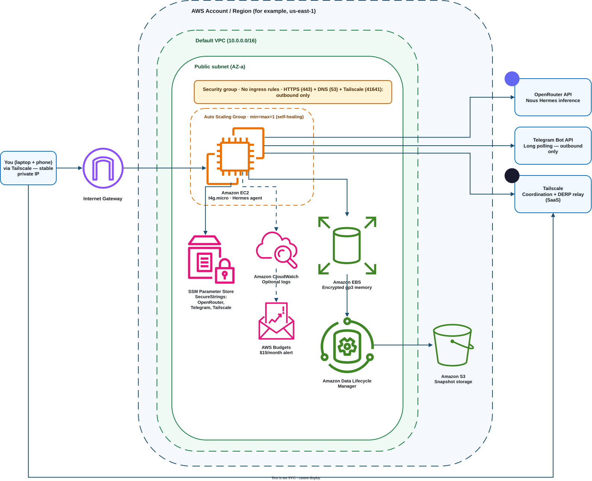

# Hermes Personalize

An AWS deployment for running a personal agent backed by the **Nous Hermes**
model on [OpenRouter](https://openrouter.ai). This repository does not host or
fine-tune a model; it provisions the infrastructure around one.

## What this repo provides

Nous Hermes already gives you the model. What it doesn't give you is a place to
run a persistent agent process against it without either paying for a GPU
instance you don't need or accepting that state disappears whenever the process
restarts. This repo addresses that gap with four things:

- **No GPU provisioning.** The model runs on OpenRouter's infrastructure and is
  billed separately by them (their per-token pricing is not included here). The
  AWS side only needs to run an orchestration process, so it uses a cheap
  Graviton instance (`t4g.micro`), not an inference-capable one.
- **Cost-effective by default.** No Elastic IP (auto-assigned public IP instead,
  which costs nothing while the instance is stopped), gp3 storage, SSM
  Parameter Store instead of Secrets Manager for secrets, and a
  stop/start-friendly design. Estimated at $4 to $14/month depending on uptime;
  see [docs/infra.md](./docs/infra.md) for the full cost breakdown.
- **Backed-up long-term memory.** Agent state lives on a separate encrypted EBS
  volume, not the OS disk, with `DeleteOnTermination=false`, EC2 termination
  protection, and a daily DLM snapshot policy (14-day retention by default).
  The goal is that the memory volume survives instance replacement, accidental
  termination, and the usual ways people lose an EBS volume.
- **Cheap and secure for the same reason.** The security group allows **no
  inbound traffic at all**. Admin access rides over [Tailscale](https://tailscale.com)
  (a private mesh network giving the instance and your devices stable IPs
  regardless of what network you're on), and messaging rides over Telegram's
  long-polling API (the instance calls out to Telegram, Telegram never calls
  in). Because nothing external ever needs to open a new connection to the
  instance, there's no load balancer, API Gateway, or NAT Gateway to provision,
  pay for, or secure — cost and attack surface shrink together here, not as a
  trade-off against each other. See [docs/infra.md](./docs/infra.md) for the
  full rationale, and the [Possible upgrades](#5-possible-upgrades) section below
  for what changes if you want a webhook-based integration (e.g. WhatsApp) or
  even tighter isolation later.

The full architecture and rationale (instance sizing, storage choice, IAM
scoping, security group rules, cost tables) are documented in
[docs/infra.md](./docs/infra.md), with a diagram at
[docs/infra.drawio](./docs/infra.drawio), rendered automatically to
[docs/export/infra.svg](./docs/export/infra.svg) by CI:



## 1. Provisioning the infrastructure

The Terraform in [terraform/](./terraform) provisions an EC2 instance, a
separate encrypted EBS volume for long-term memory, daily snapshots, IAM scoped
to least privilege, and a budget alert. Full details on each file are in
[terraform/README.md](./terraform/README.md); the essentials are below.

### Variables you need to supply

| Variable | Required? | Description |
|---|---|---|
| `key_name` | **Yes** | Name of an existing EC2 key pair to use for SSH access. Create one in the AWS Console or with `aws ec2 create-key-pair` first. |
| `budget_alert_email` | **Yes** | Email address notified when spend crosses the budget threshold. |
| `openrouter_api_key` | **Yes** (passed as an env var, not in `.tfvars`) | Your OpenRouter API key, stored as a SecureString in SSM Parameter Store. Never commit this or put it in `terraform.tfvars`, see below. |
| `telegram_bot_token` | **Yes** (passed as an env var, not in `.tfvars`) | Your Telegram bot token from [@BotFather](https://t.me/BotFather), stored as a SecureString in SSM Parameter Store. Used for long polling, so no inbound webhook is required. |
| `tailscale_auth_key` | **Yes** (passed as an env var, not in `.tfvars`) | A [Tailscale auth key](https://tailscale.com/kb/1085/auth-keys) used to join the instance to your tailnet on first boot, stored as a SecureString in SSM Parameter Store. This is what gives you a stable IP for admin access no matter where you're connecting from. |
| `aws_region` | No (default `eu-west-2`) | AWS region to deploy into. |
| `project_name` | No (default `hermes-personalize`) | Name prefix used to tag and identify all resources. |
| `instance_type` | No (default `t4g.micro`) | EC2 instance type. Move to `t4g.small` if the memory store grows (e.g. a real vector DB). |
| `root_volume_size_gb` | No (default `8`) | OS root volume size, holds the OS only, not agent memory. |
| `data_volume_size_gb` | No (default `20`) | Size of the separate EBS volume that holds long-term agent memory. |
| `snapshot_retention_days` | No (default `14`) | How many daily snapshots of the memory volume to retain. |
| `budget_limit_usd` | No (default `15`) | Monthly AWS Budget alert threshold in USD. |
| `enable_cloudwatch_logs` | No (default `true`) | Whether to create a CloudWatch Logs group for the agent process. |

### Steps

```bash
cd terraform
cp terraform.tfvars.example terraform.tfvars
# edit terraform.tfvars: key_name, budget_alert_email

terraform init

# Pass all three secrets only as env vars, never in terraform.tfvars
TF_VAR_openrouter_api_key="sk-or-..." \
TF_VAR_telegram_bot_token="123456:ABC-your-botfather-token" \
TF_VAR_tailscale_auth_key="tskey-auth-..." \
terraform plan

TF_VAR_openrouter_api_key="sk-or-..." \
TF_VAR_telegram_bot_token="123456:ABC-your-botfather-token" \
TF_VAR_tailscale_auth_key="tskey-auth-..." \
terraform apply
```

`terraform.tfvars`, `*.tfstate`, and `.terraform/` are gitignored, never commit
them. To rotate any of the three secrets later, update them directly in SSM
Parameter Store rather than via Terraform (see
[terraform/README.md](./terraform/README.md) for why — and for the one caveat
around rotating the Tailscale key specifically).

## 2. Connecting to the instance

Admin access goes over [Tailscale](https://tailscale.com), not the instance's
public IP. The instance joins your tailnet automatically on first boot (via the
`user_data` script in `terraform/main.tf`, using the `tailscale_auth_key` you
supplied), so once `terraform apply` finishes and the instance has had a minute
to boot:

1. Install Tailscale on your own machine (laptop and/or phone) and sign in to
   the same tailnet: [tailscale.com/download](https://tailscale.com/download).
2. Find the instance's Tailscale IP, either in the
   [Tailscale admin console](https://login.tailscale.com/admin/machines) or by
   running `tailscale status` on any device already in the tailnet, look for
   the hostname `<project_name>-agent`.
3. SSH to that IP with your existing key pair:
   ```bash
   ssh -i <path-to-your-key>.pem ec2-user@<tailscale-ip>
   ```
   (`terraform output ssh_instructions` prints a reminder of this.)

Notes:

- The instance's public IP (`terraform output public_ip`) still exists and
  still changes on every stop/start, exactly as before, but it's no longer
  used for admin access, only for the instance's own outbound calls to
  OpenRouter, Telegram, and Tailscale. You never need to look it up to connect.
- Because access is keyed to your device's Tailscale identity rather than your
  network's public IP, this keeps working unchanged if you're traveling or
  switching networks, there's no CIDR variable to update and no Terraform
  re-apply needed when your location changes.
- Restrict which devices can reach this node using
  [Tailscale ACLs](https://tailscale.com/kb/1018/acls) in the admin console,
  this is what replaces the security-group IP lock as the actual access-control
  layer.
- The long-term memory volume is attached separately from the OS disk. On this
  instance type it will typically show up as `/dev/nvme1n1` rather than
  `/dev/sdf`; use `lsblk` or `nvme list` on the box to confirm, then mount it
  (e.g. under `/mnt/memory`) before pointing the agent process at it.

**If Tailscale never comes up** (bad auth key, a transient failure in
`user_data`, etc.), there's a fallback that doesn't depend on it or on any
inbound rule: [AWS Systems Manager Session Manager](https://docs.aws.amazon.com/systems-manager/latest/userguide/session-manager.html).
```bash
terraform output session_manager_command
# aws ssm start-session --target <instance-id> --region <region>
```
This gets you a shell via an AWS-managed channel, authenticated by IAM rather
than network location or Tailscale's own health, so it works even when the
Tailscale bootstrap itself is the thing that's broken. It's also the fastest
way to check *why* Tailscale didn't come up: once in, check
`sudo journalctl -u tailscaled` and `sudo cat /var/log/cloud-init-output.log`
(or from your own machine, without needing any session at all:
`aws ec2 get-console-output --instance-id <instance-id>`).

## 3. Setting up Hermes persistent memory

> **Status: planned, not yet implemented.** The infrastructure to support this
> (a separate encrypted EBS volume, `DeleteOnTermination=false`, daily snapshots
> via DLM) is already provisioned by Terraform. The agent process and its
> memory layer itself have not been built yet.

The intended design, per [docs/infra.md](./docs/infra.md):

1. Run the agent process on the EC2 instance, long-polling the Telegram Bot API
   for new messages and calling the OpenRouter chat completions API for the
   Nous Hermes model.
2. Persist conversation history, and eventually embeddings for semantic recall
   (a lightweight vector store or SQLite database), to the mounted memory
   volume, not to the OS disk, so it survives instance replacement.
3. Rely on the DLM daily-snapshot policy (retain 14 days by default) as the
   safety net for that data; the memory volume itself is protected from
   accidental deletion via `prevent_destroy` and EC2 termination protection.

This section will be filled in with concrete setup steps once the agent process
and memory layer are implemented.

## 4. Connecting with Telegram

> **Status: planned, not yet implemented.** The Tailscale/no-ingress networking
> this relies on is already provisioned by Terraform; the agent process itself
> (the thing that actually calls Telegram and OpenRouter) has not been built yet.

The intended design is **long polling**, not a webhook: the agent process calls
Telegram's `getUpdates` endpoint from inside the instance, which holds the
connection open and returns as soon as a message arrives (or times out and gets
called again). This is a deliberate choice over Telegram's alternative webhook
mode (`setWebhook`): long polling is entirely outbound-initiated, so it needs no
public HTTP endpoint, no inbound security group rule, and no load balancer or
API Gateway in front of the instance, it fits the "no ingress at all" design
described above with zero additional infrastructure.

Setup, once the agent process exists:
1. Create a bot via [@BotFather](https://t.me/BotFather) and get its token.
2. Store it as `telegram_bot_token` at `terraform apply` time (see above), it
   ends up in SSM Parameter Store for the agent process to read at runtime.
3. Point the agent process's polling loop at that token, no further
   infrastructure changes needed.

This section will be filled in with concrete setup steps once the agent process
exists. If you want WhatsApp instead of (or alongside) Telegram, see
[Possible upgrades](#5-possible-upgrades) below, WhatsApp's Cloud API requires a
webhook, so it needs a bit more infrastructure than Telegram does.

## 5. Possible upgrades

This design intentionally starts from the cheapest, most locked-down
configuration that still does the job: no ingress at all, admin access over
Tailscale, messaging over Telegram long polling. Two directions you might want
to extend it from here, one for functionality, one for tightening security
further. **The rule for both: never lower the security bar this design starts
from.** Any change that adds a genuinely public inbound path (an open security
group rule, a directly-exposed instance) is a regression, not an upgrade, unless
it's offset by an equivalent or stronger control (e.g. a managed edge service
that absorbs the exposure instead of the instance, plus app-layer verification).

### Adding functionality: WhatsApp webhook support

WhatsApp's Business Cloud API doesn't support long polling, only a webhook, so
supporting it means accepting *some* inbound path from the internet. The way to
do this **without** reopening the instance's own exposure:

- **API Gateway** (HTTP API) as the only public-facing piece, its own
  managed HTTPS endpoint, no cert management on your side.
- **VPC Link** connecting that route privately into the VPC.
- An internal **ALB or NLB** (no public IP of its own) as the VPC Link's
  target, forwarding to the instance's private IP. (Or skip the load balancer
  and use a VPC Link private integration via **AWS Cloud Map** instead,
  cheaper, but you're responsible for registering/deregistering the instance
  yourself rather than getting automatic target-group health checks.)
- The EC2 security group still gets **no new ingress rule** — the only thing
  that changes is that it now also accepts traffic from the internal load
  balancer/Cloud Map path, which never touches the public internet directly.
- WhatsApp's webhook verify token and payload signature (`X-Hub-Signature-256`)
  become your application-layer check on top of the network-layer isolation,
  not a replacement for it.

Expect roughly **+$16–20/month** for the load balancer (the Cloud Map option
instead would run a few dollars/month). This is strictly additive: it gives
WhatsApp a way in without giving the internet at large a way into the instance
itself.

### Tightening security further: NAT Gateway + fully private subnet

Today the instance keeps a public IP purely so its own outbound calls
(OpenRouter, Telegram, Tailscale, SSM) can leave directly via the Internet
Gateway, without needing a NAT Gateway. The security group already blocks all
inbound traffic, so this isn't an exposed inbound surface, but the instance is
still technically addressable from the internet (a port scan would see *a*
host there, just one with everything closed).

To remove that entirely:
- Move the instance into a **private subnet** (no public IP at all).
- Add a **NAT Gateway** for its own outbound calls, since OpenRouter, Telegram,
  and Tailscale are all external services with no AWS PrivateLink support, so
  VPC endpoints alone can't replace this leg (VPC endpoints would still be
  worth adding for SSM/KMS/CloudWatch traffic, to keep as much as possible off
  the NAT path).
- Everything else (Tailscale for admin access, Telegram long polling, the
  closed security group) stays exactly as-is; this only removes the instance's
  public IP, it doesn't change how anything connects to it.

Expect roughly **+$35–40/month** for the NAT Gateway (hourly charge + its own
EIP + data processing), a real cost jump for a marginal security gain given the
security group already blocks all inbound traffic, worth doing if you want
defense-in-depth against unknown future AWS/security-group misconfiguration,
not because the current setup has a known gap.
